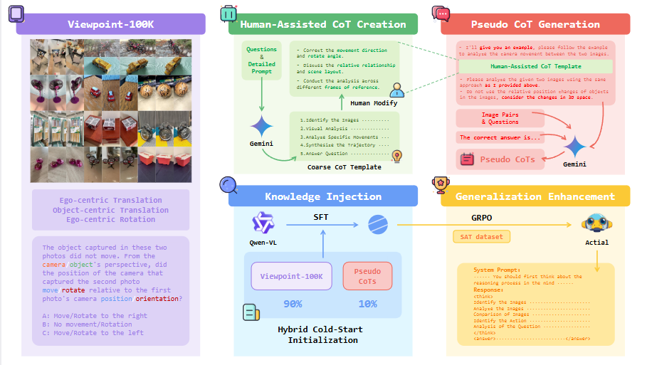

<p align="center">

<h2 align="left">Actial: Activate Spatial Reasoning Ability of Multimodal Large Language Models [Neurips 2025]</h1>
  <p align="left">
    <a href="https://zhanxy.xyz/" rel="external nofollow noopener" target="_blank"><strong>Xiaoyu Zhan*</strong></a>
    ·
    <strong>Wenxuan Huang*</strong></a>
    ·
    <strong>Hao Sun*</strong></a>
    ·
    <strong>Xinyu Fu</strong></a>
    ·
    <strong>Changfeng Ma</strong></a>
    ·
    <strong>Shaosheng Cao✝</strong></a>
    ·
    <strong>Bohan Jia</strong></a>
    ·
    <strong>Shaohui Lin</strong></a>
    ·
    <strong>Zhenfei Yin</strong></a>
    ·
    <strong>Lei Bai</strong></a>
    ·
    <strong>Wanli Ouyang</strong></a>
    ·
    <a href="http://www.njumeta.com/liyq/" rel="external nofollow noopener" target="_blank"><strong>Yuanqi Li</strong></a>
    ·
    <a href="https://scholar.google.com.hk/citations?user=Sx4PQpQAAAAJ&hl=en" rel="external nofollow noopener" target="_blank"><strong>Jie Guo</strong></a>
    ·
    <a href="https://cs.nju.edu.cn/ywguo/index.htm" rel="external nofollow noopener" target="_blank"><strong>Yanwen Guo✝</strong></a>

</p>
  <p align="left">
    <a href="https://arxiv.org/abs/2511.01618" rel="external nofollow noopener" target='_blank'>
        </a>
  </p>

</p>

### This is the official implementation of the paper "Actial: Activate Spatial Reasoning Ability of Multimodal Large Language Models"

<br>



## Overview

- [1 - Data](#Data)
- [2 - SFT Training](#sft)
- [3 - RL Training](#rl)
- [4 - Eval](#eval)
- [5 - Acknowledgments](#acknowledgments)
- [6 - Citation](#citation)
- [7 - Contact](#contact)

<a id="Data"></a>

## 📍 Data

### 1. Training Data

We adopted a two-stage training process, with training data for the first stage stored on [SFT-data](https://huggingface.co/datasets/INno0o/Viewpoint-100K) and data for the second stage hosted on [RL-data](https://huggingface.co/datasets/INno0o/SAT).

You can also construct your own datasets. The raw data for our SFT stage is sourced from [MVImgNet](https://github.com/GAP-LAB-CUHK-SZ/MVImgNet), and the data for our RL stage is derived from the [SAT](https://huggingface.co/datasets/array/SAT) dataset.

### 2. Model

To be continued

<a id="sft"></a>

## 🚀 SFT Training

### 1. Download Preprocessed Data and Model
SFT Data:
[SFT-data](https://huggingface.co/datasets/INno0o/Viewpoint-100K)

Base Model in huggingface:
[Qwen-2.5-VL Model](https://huggingface.co/Qwen/Qwen2.5-VL-7B-Instruct)

Also in modelscope:
[modoelscope](https://www.modelscope.cn/models/Qwen/Qwen2.5-VL-7B-Instruct)
### 2. Train Model

We utilized LLaMA Factory, one of the most prevalent instruction-tuning frameworks, for model fine-tuning. First, you need to refer to the project repository at [LLaMA-Factory](https://github.com/hiyouga/LLaMA-Factory) to complete the installation, and then follow the official tutorials to execute the training process.

During the Supervised Fine-Tuning (SFT) phase, we configured the training with 2 epochs, a learning rate of 5e-6, a batch size of 128, and 50 warm-up steps.

<a id="rl"></a>

## 🎯 RL Training

### 1. Environment

We employed the [Verl](https://github.com/volcengine/verl) framework for two-stage reinforcement learning training.
You can either use the latest version of Verl for training or install the Verl package included in this repository to proceed.


> [!IMPORTANT]
> We adopted a custom reward function, which can be found in detail under the path verl\utils\reward_score\reward_custom.
> Additionally,  It may need attention multi-image input and the image processing mechanism of Verl.

### 2. Training

```bash
# Modify first: supplement or adjust the necessary parameters.
sh run/run_qwen2_5vl-7b_mix_500step.sh

```


<a id="eval"></a>

## 🎨 Eval

We evaluated the model using VLMEvalKit. First, you need to install it.

```bash
cd VLMEvalKit
pip install -e .
```
Next, you need to launch the model service using VLLM, referring to the script run_actial.sh.

Finally, modify the actial_test.json file and then launch the evaluation.

```bash
python run.py --config actial_test.json
```

check [VLMEvalKit](https://github.com/open-compass/VLMEvalKit) docs for more information

## Acknowledgments

This work was supported by the National Natural Science Foundation of China (62032011) and the Natural Science Foundation of Jiangsu Province (BK20211147).

There are also many powerful resources that greatly benefit our work:

- [VisionR1](https://github.com/Osilly/Vision-R1)
- [MVImgNet](https://github.com/GAP-LAB-CUHK-SZ/MVImgNet)
- [SAT](https://github.com/arijitray1993/SAT)
- [Verl](https://github.com/volcengine/verl)
- [VLMEvalKit](https://github.com/open-compass/VLMEvalKit)

## Citation

If you find this work helpful, please consider citing our paper.

```bibtex
@inproceedings{
zhan2025actial,
title={Actial: Activate Spatial Reasoning Ability of Multimodal Large Language Models},
author={Xiaoyu Zhan and Wenxuan Huang and Hao Sun and Xinyu Fu and Changfeng Ma and Shaosheng Cao and Bohan Jia and Shaohui Lin and Zhenfei Yin and LEI BAI and Wanli Ouyang and Yuanqi Li and Jie Guo and Yanwen Guo},
booktitle={The Thirty-ninth Annual Conference on Neural Information Processing Systems},
year={2025},
url={https://openreview.net/forum?id=jquTBzt3Av}
}
```

## Contact

Zhan, Xiaoyu (zhanxy@smail.nju.edu.cn) and Sun, Hao (warm_snows@163.com).
